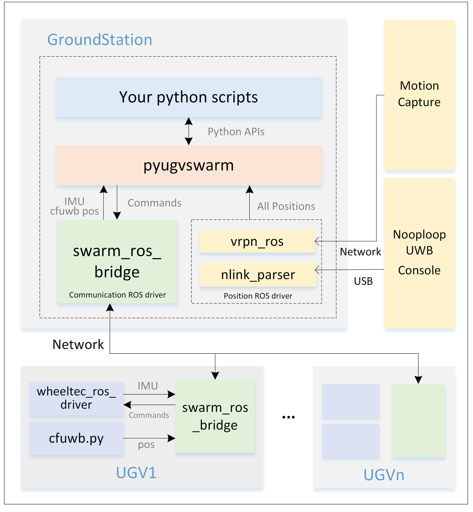
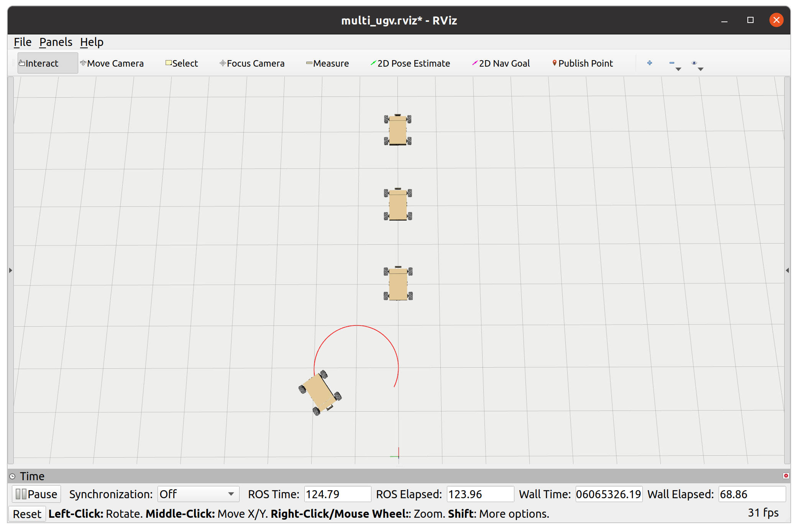

# pyugvswarm

### Introduction
pyugvswarm is a python package wrapper around the unmanned ground vehicle (UGV) swarm positioning / communication / control ROS1 nodes. We offer python APIs which simplifies the development of UGV swarm. A lightweight python simulator is also provided to validate your program before the real experiment.

Online document: https://pyugvswarm.readthedocs.io/

Github repository: https://github.com/shupx/pyugvswarm.git

Gitee repository: https://gitee.com/shu-peixuan/pyugvswarm.git

This python wrapper should be used with other submodules like [swarm_ros_bridge](https://gitee.com/shu-peixuan/swarm_ros_bridge)(for communication) and positioning ROS packages. The framework is shown below:




### Install

Dependencies for real experiment:

```bash
# If you use mocap for positioning, then you should install vrpn  
# change 'noetic' into 'melodic' for ubuntu18:
sudo apt install -y ros-noetic-vrpn-client-ros

# If you use UWB for positioning, then you should build `nlink_parser` (https://www.nooploop.com/download) ROS package for nooploop UWB module:
cd ~
mkdir -p nlink_parser_ws/src
cd nlink_parser_ws/src
git clone --recursive https://gitee.com/shu-peixuan/nlink_parser.git
cd ../
catkin_make
catkin_make
echo "source ~/nlink_parser_ws/devel/setup.bash" >> ~/.bashrc
```

- #### Method 1 (recommended): 

Install `pyugvswarm` python package from source:

```bash
git clone https://gitee.com/shu-peixuan/pyugvswarm.git
cd pyugvswarm/
pip install -e . # use pip3 if you use python3 in ubuntu18
```
Check you have pyugvswarm package in your PYTHON environment:

```bash
pip show pyugvswarm # use pip3 if you use python3 in ubuntu18
```

To uninstall pyugvswarm:

```bash
pip uninstall pyugvswarm # use pip3 if you use python3 in ubuntu18
```

- #### Method 2: 

You can simply copy the `pyugvswarm/pyugvwarm/` folder and optionally `config/` folder into your project:

```bash
git clone https://gitee.com/shu-peixuan/pyugvswarm.git
cp -r pyugvswarm/pyugvswarm ${your_scripts_path}
cp -r pyugvswarm/config ${your_scripts_path} # optional
```

The folder structure should be like this:

```bash
|__ Your scripts folder
   |_ pyugvswarm/
   |_ config/
   |  |_ ugvs.yaml
   |_ your_python_script.py
```

- #### Method 3 (simple): 

Write your python scripts directly in this repository like the `example.py`.

```bash
git clone https://gitee.com/shu-peixuan/pyugvswarm.git
cd pyugvswarm/
touch your_python_script.py
```


### Usage

1. Specify your ugvs information in a configuration file similar to `config/ugvs.yaml`. 


2. Import the `UGVswarm` class of this python package in your project. See the example of `example.py`.

```python
# in your python script
from pyugvswarm import *

swarm = UGVswarm('your config file path') # absolute path is recommended
timeHelper = swarm.timeHelper
allugvs = swarm.allugvs

ugvs = allugvs.ugvs
ugv_0 = ugvs[0]
```

3. Run the positioning & communication nodes and your script:

```bash
### For simulation
python example.py --sim  # --dt=0.1 --vis=null

### For experiment
## on UGV7 for example:
roslaunch turn_on_wheeltec_robot turn_on_wheeltec_robot.launch
cd launch/
roslaunch swarm_ros_bridge_ugv7.launch # communication

## on Ground Station
cd launch/
roslaunch swarm_ros_bridge.launch # communication
roslaunch vrpn.launch # mocap
# roslaunch launch/linktrack.launch # uwb
python example.py
```

Or use shell script:

```bash
cd launch/
./run_sim.sh # for simulation
./run_sim_display.sh # for matplot 3d display 
./run_exp_mocap.sh # or nluwb,cfuwb for experiment
```

### API reference

Refer to https://pyugvswarm.readthedocs.io/en/latest/api_reference.html

The most common use:

```py
ugv.cmdVelBody(vx,vy,w) # send speeds in body frame
ugv.stop() # stop
allugvs.stop() # stop all ugvs
ugv.position() # return xyz array (m)
ugv.yaw() # return yaw (rad)
timeHelper.time() # return time (s)
timeHelper.sleepForRate(rate) # sleep for rate
timeHelper.sleep(time) # sleep for seconds
timeHelper.plot_data() # plot x-y, yaw-t (for simulation only)
```

### Supplement

You can also use [swarm_sync_sim](https://gitee.com/bhswift/swarm_sync_sim.git) for simulation. It provides simulated UGV ROS nodes.

```bash
### 1. Launch sim clock and multiple ugv sim nodes (Specify initial poses, ugv types in the launch file)
roslaunch sss_sim_env sim_clock.launch max_speed_ratio:=1 auto_start:=true 
roslaunch ugv_sim multi_ugv_sim.launch
### Or simply use wallclock time (But not able to accelerate simulation)
roslaunch ugv_sim multi_ugv_sim.launch use_sim_time:=false

### 2. Run your control scripts
python example.py
```

To use swarm_sync_sim, specify UGV `pos_source` and `yaw_source` as `pose` which means directly getting pos and yaw from `/${prefix}${id}/pose` topic.



### Contributor

Peixuan Shu (shupeixuan@qq.com)

### Acknowledgement

This project is mainly inspired by the `pycrazyswarm` of [crazyswarm](https://github.com/USC-ACTLab/crazyswarm/tree/master/ros_ws/src/crazyswarm/scripts/pycrazyswarm), which is a python wrapper around crazyswarm ROS nodes to control crazyflie UAV swarm. Thanks for their remarkable work! Crazyswarm1 documentation: https://crazyswarm.readthedocs.io/en/latest/
